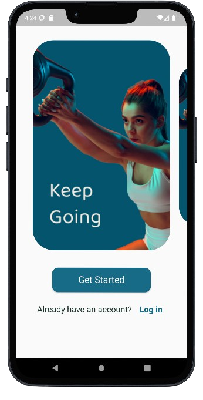
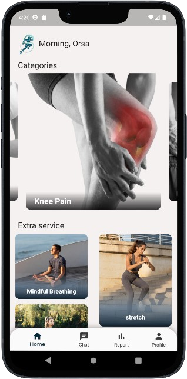
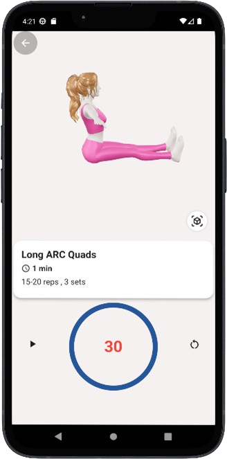
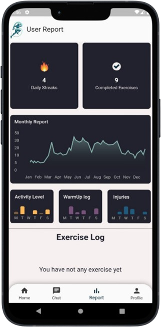

# Salamtk

Salamtk is a flutter Augmented Reality application for our graduation.

## Table of contents

- [Quick start](#quick-start)
- [What's included](#whats-included)
- [Screenshots](#screenshots)
- [Creators](#creators)
- [Thanks](#thanks)
- [Copyright and license](#copyright-and-license)

## Quick start

Follow these steps to get started with the Flutter Augmented Reality Physical Therapy app.

### Prerequisites

Make sure you have the following installed on your development machine:

- [Flutter SDK](https://flutter.dev/docs/get-started/install)
- [Dart SDK](https://dart.dev/get-dart)
- [Android Studio](https://developer.android.com/studio) or [Xcode](https://developer.apple.com/xcode/) (for iOS development)
- A physical device or emulator for testing (AR features might not work well on simulators)

### Installation

1. **Clone the repository**:
    ```bash
    git clone https://github.com/Mohamednabih1/graduation-project.git
    cd graduation-project
    ```

2. **Install dependencies**:
    ```bash
    flutter pub get
    ```

3. **Configure platform-specific settings**:

    - **For Android**:
      - Open the project in Android Studio.
      - Ensure you have the necessary permissions set in `AndroidManifest.xml` for camera and internet access.

    - **For iOS**:
      - Open the `ios` directory in Xcode.
      - Ensure you have the necessary permissions set in `Info.plist` for camera and internet access.

### Running the App

1. **Connect your device** or start an emulator.

2. **Run the app**:
    ```bash
    flutter run
    ```

### Additional Notes

- **AR Features**: Make sure your device supports ARCore (for Android) or ARKit (for iOS).
- **Permissions**: The app requires camera access to provide augmented reality features.
- **Physical Therapy Exercises**: Follow the in-app instructions to perform physical therapy exercises using AR.

### Troubleshooting

- If you encounter issues with dependencies, make sure your Flutter SDK is up to date:

    ```bash
    flutter upgrade
    ```
- For detailed error messages, check the console output when running the app.

For more detailed information, please refer to the [Flutter documentation](https://flutter.dev/docs).

## What's Included

### Main Functionality: Rehabilitation Exercises
The core feature of the app revolves around providing users with a comprehensive set of rehabilitation exercises tailored to their specific injuries or conditions. These exercises are designed to aid in recovery and improve mobility and strength.

### Exercise Visualization
Users can view the rehabilitation exercises through various visualization methods, including:
- **Camera**: Users can use their device's camera to overlay exercise instructions onto their physical environment, helping them perform the exercises with proper form and technique.
- **3D Models**: Augmented reality (AR) technology allows users to visualize exercises using 3D models, offering a more immersive and interactive experience.

### Exercise Reference
Each exercise comes with detailed instructions and reference materials, ensuring users understand how to perform them correctly and safely.

### Additional Services
In addition to rehabilitation exercises, the app offers extra services to enhance the user experience:
- **Stretching and Relaxation Videos**: Users can access a library of videos demonstrating stretching and relaxation techniques to complement their rehabilitation routine.
- **Real-Time Chat with Doctors**: Users have the opportunity to engage in real-time chat conversations with healthcare professionals and fellow patients. This feature enables users to seek advice, discuss their injuries, and receive personalized guidance from experts.
- **Comprehensive Reports**: The app generates detailed reports summarizing the user's exercise history, progress, streaks, and other relevant metrics. These reports provide valuable insights into the user's rehabilitation journey and help track their improvement over time.

### Seamless Integration
All features are seamlessly integrated into the app's user interface, providing a user-friendly and intuitive experience. Whether users are performing exercises, watching videos, chatting with doctors, or reviewing their progress, they can navigate the app effortlessly.

### Continuous Improvement
The app is continuously updated with new exercises, features, and improvements based on user feedback and advancements in rehabilitation science. Our goal is to provide users with the most effective tools and resources to support their recovery journey.

## Screenshots

    
 
    


## Creators

**[Ahmed Ehab](https://github.com/Ahme10D6)**

[](https://www.linkedin.com/in/ahmed-ehab-6103a8216/)

**[Mohamed Nabih](https://github.com/Mohamednabih1)**

[](https://www.linkedin.com/in/mohamed-nabih-mn03/)

**[Roaa Ayman](https://github.com/roaaayman21)**

[](https://www.linkedin.com/in/roaa-ayman-a9195022a/)

**[Ayat Ashraf](https://github.com/AyatAmin)**

[]()

**[Ahmed Essam](https://github.com/)**

[](https://www.linkedin.com/in/ahmed-essam-a62218237?utm_source=share&utm_campaign=share_via&utm_content=profile&utm_medium=ios_app)

## Thanks
<div align="center">

   **{وَإِذ تَأَذَّنَ رَبّكم لَئِن شَكَرتم لَأَزِيدَنَّكم وَلَئِن كَفَرتم إِنَّ عَذَابِي لَشَدِيدٌ}**

</div>

Thank Allah, for guiding us through our project and helping us learn along the way, we express our heartfelt gratitude to Professor [Alaa Zaghloul](https://www.linkedin.com/in/alaa-zaghloul-mahmoud-kietkat-baa663218/) for his invaluable guidance and support throughout our project. We are thankful for the opportunity to work under his supervision and benefit from his profound knowledge and expertise.

## License


---
<div align="center" >
Happy coding 👩‍💻👩‍💻
</div>
